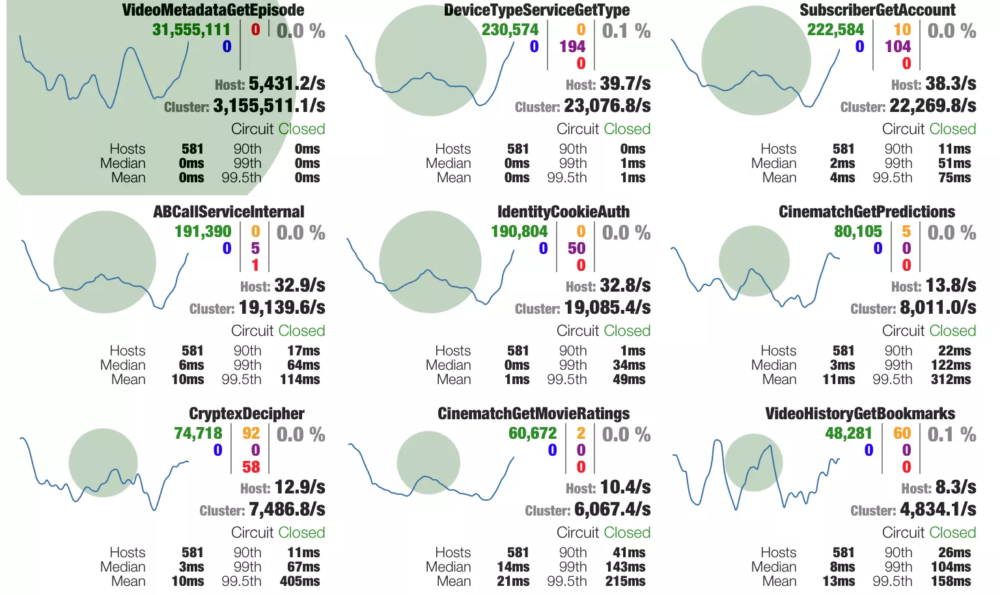
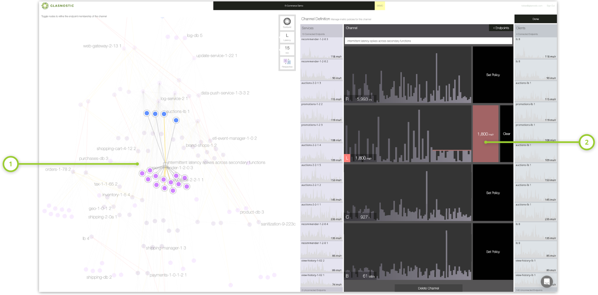
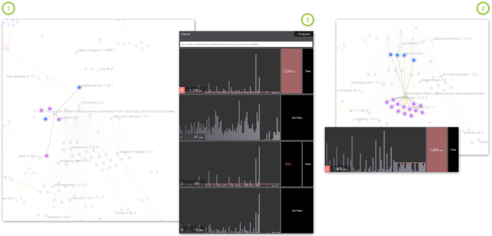

## 编者按

本文是一篇来自Glasnostic官网的博客。作为介绍熔断系列文章的第二篇，本文通过介绍开发人员和运维人员两种不同视角下的微服务典型应用场景，引入进阶的熔断功能。进而分别介绍和对比了熔断功能的三种不同实现：Hystrix, Service Mesh (Istio、linkerd) 和 Glasnostic。

## 前言


*这是关于熔断的两部分系列文章的第二部分。在[第一部分](https://glasnostic.com/blog/preventing-systemic-failure-circuit-breaking-part-1)中，我们介绍了该模式以及开发人员和运维人员如何以不同的方式处理它。而在本文中，我们将探讨它的典型应用场景以及如何在现代服务中间件中实现它。*

## 典型的微服务应用场景

开发人员和运维人员通常为不同的目的使用熔断。开发人员主要关心的是保护他们的代码，他们把熔断作为补偿上游故障的一种方法。另一方面，运维人员负责整个服务环境的稳定性和可用性，因此主要使用熔断来监控和补救。

### 开发人员：对上游故障的补偿

除了“熔断”和继续前进，开发人员主要关心断路器的三个好处。首先，由于断路器允许开发人员处理服务故障，客户端可以以一种优雅的方式随时间动态地适应服务可用性的变化。其次，在微服务架构中共享状态的断路器提供了网络效果，可以显著提高故障响应能力。第三，断路器与智能路由和负载均衡相结合，可以自动用健康的服务实例替换故障的服务实例，从而促进自修复。

### 运维人员：监控和补救

断路器是运维团队在问题升级为更大问题之前发现问题的好方法。当断路器跳闸时，负责的工程团队调查相关日志和指标，运维员可能会决定将部分或大部分流量从服务中分流。由于它缓解了系统的急性压力、分流或削减负荷，因此成为了运维团队中对于断路器最流行的使用方式。

另一个密切相关的变体是将断路器定义为这种架构中预先确定的断点。理想情况下，这种断路器应该安装在已知能够承受与关键系统成正比的负载的地方。这类断路器在本质上就像架构中的金丝雀(canaries)一样工作，通过卸载来促进再修复。

### 进阶的熔断

随着断路器从客户端库发展到中间件、共享状态断路器和平台，它们的定义也变得越来越多样化。断路器的开发人员和运维人员的应用场景出现了分歧，其定义涉及越来越多的参数。目前云流量控制器(如Glasnostic)所提供的熔断功能，可以应用于由任意端点集定义的通信链路，并结合一些互补模式(如超时、反压或[Brownouts](https://blog.acolyer.org/2014/10/24/brownout-building-more-robust-cloud-applications/))。然后，随着时间的推移，结合一些参数(如请求速率、并发性、带宽或延迟)对这些模式组合进行优化。

## Hystrix的熔断

[Netflix' Hystrix](https://github.com/Netflix/Hystrix)是第一个专门用于熔断的服务中间件。当它在2012年向公众发布，以提供“对延迟和失败有更大容忍度”的微服务架构时，Netflix已经在内部广泛使用了一年多的时间了。根据这个[项目](https://github.com/Netflix/Hystrix)的描述，Hystrix一直是Netflix服务中间件的基本组成部分之一，直到2018年底进入维护模式，这标志着“[关注点]转向更适应应用程序实时性能的实现，而不是预先配置的设置。”

Hystrix是一个Java库，开发人员可以使用它用熔断逻辑封装服务调用。它基于阈值，可以立即判定调用失败并执行回滚逻辑，具体参考[第一部分](https://glasnostic.com/blog/preventing-systemic-failure-circuit-breaking-part-1#figure-1)。除了提供超时和并发限制之外，它还可以向监视工具发布度量metrics。最后，当与[Archaius](https://github.com/Netflix/archaius)库一起使用时，它还可以支持动态配置更改。



**Figure 1**. *Hystrix* [dashboard](https://github.com/Netflix-Skunkworks/hystrix-dashboard) *显示了请求量、各种交互指标和中断状态。圆圈表示请求量，火花线表示过去2分钟内的呼叫量的变化。*

尽管Hystrix支持将熔断与超时和并发池相结合等改进，但最终证明它对于现代有机体系结构中日益动态的交互行为不够灵活。设置阈值和客户端并发池的能力为服务开发人员提供了足够的控制，使他们能够将代码与上游故障隔离开来，但是当系统和运维关注点变得重要时，这种能力就不再有用了。因此，Hystrix的衰落是作为开发者模式下的熔断带来的限制的直接后果。

## 服务网格中的熔断

### Istio

[Istio](https://glasnostic.com/blog/kubernetes-service-mesh-what-is-istio)是一个服务网格，它支持基于连接池、每个连接的请求和故障检测参数的熔断。它是在所谓的“目的地规则(destination rules)”的帮助下做到这一点的，该规则告诉每个Envoy代理应用于通信的策略是什么，以及如何应用。这个步骤发生在路由之后，然而这并不总是理想的。目标规则可以指定负载均衡的限制、连接池大小以及最终符合“异常值”条件的参数，以便可以从负载均衡池中删除不健康的实例。这种类型的熔断擅长于使客户端免受服务端故障的影响，但是由于目标规则总是在集群范围内应用，所以它缺乏一种方法来将断路器限制在客户端的一个子集内。为了实现断路器与服务质量模式(quality-of-service)的组合，必须创建多个客户机子集的路由规则，并且每个子集都有自己的目标规则。

```yaml
apiVersion: networking.istio.io/v1alpha3
kind: DestinationRule
metadata:
  name: some_microservice
spec:
  host: some_microservice_host
  trafficPolicy:
    connectionPool:
      tcp:
        maxConnections: 10
      http:
        http1MaxPendingRequests: 20
        http2MaxRequests: 20
        maxRequestsPerConnection: 3
    outlierDetection:
      consecutiveErrors: 2
      interval: 2s
      baseEjectionTime: 30s
      maxEjectionPercent: 100
```

**Figure 2**. *示例Istio断路器配置，可以直接通过kubectl命令执行。这种配置指定了基于连接池和故障(“outlierDetection”)参数的熔断。在连接端，超过10个打开的TCP连接、超过20个挂起的HTTP请求或每个连接超过3个挂起的请求都会触发断路器。在故障检测方面，任何两个连续错误在两秒内相继发生，都会导致目标主机从负载均衡池中弹出至少30秒。*

### Linkerd

Linkerd中的熔断有点复杂，作为一种开发者模式，它反映了熔断的一般冲突状态。在Linkerd 1继续支持由原先花里胡哨的代码实现的[完整的断路器](https://linkerd.io/1/features/circuit-breaking/)的同时，一个完整的、轻量级的由Rust和Go重写的[Linkerd 2](https://glasnostic.com/blog/an-introduction-to-what-is-linkerd-service-mesh)，却不[直接](https://github.com/linkerd/linkerd2/issues/1255)这么做。相反，它在其Conduit代理中提供了相关的功能，虽然不支持重试和超时，但它现在已经合并到Linkerd 2中。

为了支持重试和超时，Linkerd 2.1引入了“service profiles”的概念，这是定制化的Kubernetes资源，用于向Linkerd提供关于服务的额外信息。使用服务profile文件，运维人员现在可以将路由定义为“可重试”或具有特定超时机制。虽然这提供了一些与之相关的基本功能，但是Linkerd中的熔断仍然是一个很长的路要走。

## Glasnostic中的熔断

Glasnostic是一个云流量控制器，它使运维团队能够有效控制他们的有机架构所衍生的复杂的紧急异常。这使公司能够以敏捷的方式运行不同的架构模式，而无需对每个更改进行昂贵的重新验证。因此，开发和运营都处于理想的位置，以适应公司快速变化的业务需求。

与Hystrix和service meshes不同的是，它们从开发人员的角度实现了熔断，而Glasnostic将熔断作为一种运维模式来实现，这是为运维人员设计的。

Glasnostic的控制平面提供了大规模、复杂和动态交互行为的高可视性，使运维人员能够快速修复问题。通过对任意服务端点集之间的交互进行细粒度控制，运维人员能够应用经过实践验证的、可预测的运维模式，比如断路。因为运维模式可以很容易地结合起来形成高度精炼的复合模式，所以断路器同样可以根据请求速率、带宽或并发数，通过将它们与[backpressure](https://glasnostic.com/blog/preventing-systems-fail-backpressure)等结合起来，轻松地进行改进。

例如，**Figure 3**显示了一个通道（channel）的设置，该通道用于监视和控制一组互不相关的服务中间歇重复出现的延迟峰值。在不寻找假定的出错根源的情况下，运维人员决定首先通过中断更长时间运行的请求来控制这种情况。他们首先定义一个覆盖有问题的服务和任何潜在客户端的新通道，然后对通道控制的交互施加适当的延迟限制，从而实现这一点。这使得运营团队能够在发生问题时控制局面，直到工程师能够提供一个修复方案。



**Figure 3**. *Glasnostic 控制台，显示一个通道(1)，用于监视和控制一系列服务中间歇重复出现的延迟峰值。将断路器配置为延时达到1800毫秒(2)时跳闸，作为运维团队的早期预警系统，同时控制情况。一旦负责维修的工程团队确定了修复方案，就可以移除断路器了。*

当然，最初的政策往往只是首先尝试补救局面，并且需要对调整保持开放的态度。调整或补充开放政策既快又容易。例如，运维团队可能会发现，初始通道策略可以通过第一个断开非关键任务客户机的电路来进一步细化，从而使关键任务客户机尽可能长时间地不受影响。为了实现这一点，他们可以定义一个只覆盖非关键任务客户端的细化通道，并添加一个基于连接和请求许可中断它们的策略。**Figure 4**显示了这样一个辅助细化通道，在原始延迟断路器跳闸之前，通过设置的并发性和请求策略切断链路中非关键的客户端，从而提高了关键任务系统的可用性。



**Figure 4**. *Glasnostic控制台显示之前设置的通道(2)的细化通道(1)，首先根据连接池和请求速率参数配置断开非关键任务客户端，从而延迟了关键客户端(3)的熔断。*

与通常由服务中间件(如API网关和服务网格)提供的断路器不同，Glasnostic支持将断路器作为一种运维模式，在任意端点集之间实时进行，而不是通过静态部署描述符进行。这允许运维人员指定断路器，这些断路器不仅是对本地交互的战术调整，而且是改善稳定性和可用性的步骤，这对整个服务领域都是有意义的。例如，当Istio基于目的地规则实现熔断时，Glasnostic可以将熔断应用于任何一组交互、客户端或服务端，过去、现在或未来。因此，运维人员可以为不同的流量类型设置不同的策略。

## 总结

熔断是一种基本模式，旨在将故障的影响降到最低，防止级联故障和雪崩，并确保端到端性能。因为可以同时作为开发人员模式和运维模式使用，熔断被广泛地应用，但这也常常会引起混淆。

作为一种开发人员模式，它主要用作一种相当基本的补偿策略，如果不考虑每个特定的调用，就很难对其进行细化。另一方面，断路器作为一种运维模式，旨在减轻系统的压力，以管理系统的稳定性和性能。通过将其与其他稳定模式(如超时或背压)相结合，通常可以进一步改进其行为。运维断路器过去依赖于单独部署的服务中间件，如API网关或服务网格。然而，由于服务网格主要解决了开发人员的关注点，所以作为一种运维模式对断路的支持是有限的，而且在实现之间是不一致的。
